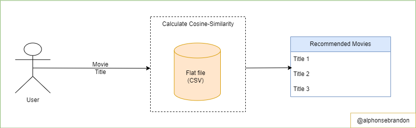

# Movie Recommendation Engine

#### -- Project Status: Active

## Introduction

Think of Netflix, YouTube. How do they know you would enjoy watching a  specific movie/video? Oh yes! you guest it right, through a recommendation algorithm.

### Objectivie

Implement a content based filtering algorthing which recommends a movie to a user based on simirlar charateristics in related movies using cosine similarity

### Methods Used

* Inferential Statistics
* Algebra/Matrices
* Cosine Similarity
* Machine Learning

### Technologies

* Python
* Jupyter
* Git

### Description

My dataset was collected by scraping wikipedia website to get american movies from 2018 to 2022, while downloading the dataset containing movies from the 80s to 2017.

The key component behind this content based filtering technique is the use of cosine similarity which is  the measure of the similarity between two vectors in a vectors of an inner product space

### Geting Started

1. Clone this repository to your local machine
2. Open the folder in a code editor of your choice
3. If you are on mac or linux (or using wsl in windows) Use bash to install the setup.sh file in the conf folder, this will create a python virtual enviroment and install all the packages in the requirements.txt file used in this project
4. If you are on windows, create your virtual environment and install the requirements.txt file to get all the packages used in this project

### Folder Description

* conf: contains the bash script to install to setup the project if you are using mac, linux or windows-wsl
* data: contains the movie data used in this project
* notebooks: contains the notebooks used to run experiments
* references: contains the data dictionary to know what each colum represents and a link to a blog article to read more about cosine similarity and contained based filetering
* src: contains the script use to run this project in production environment
